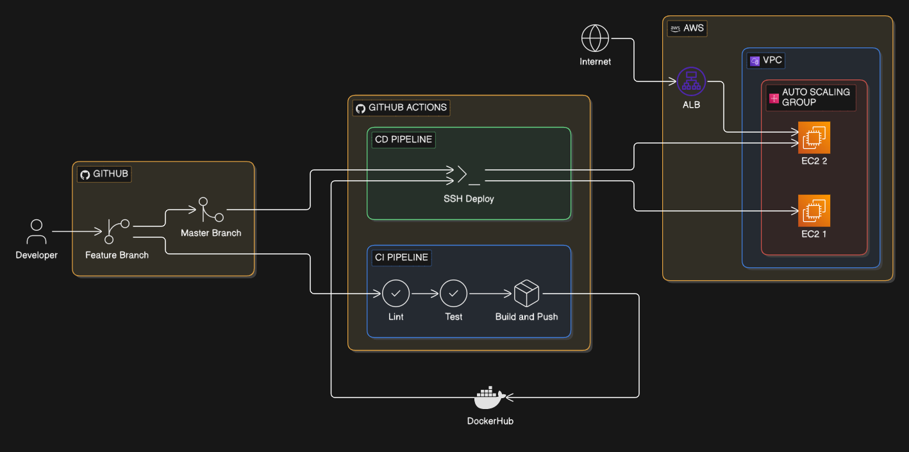
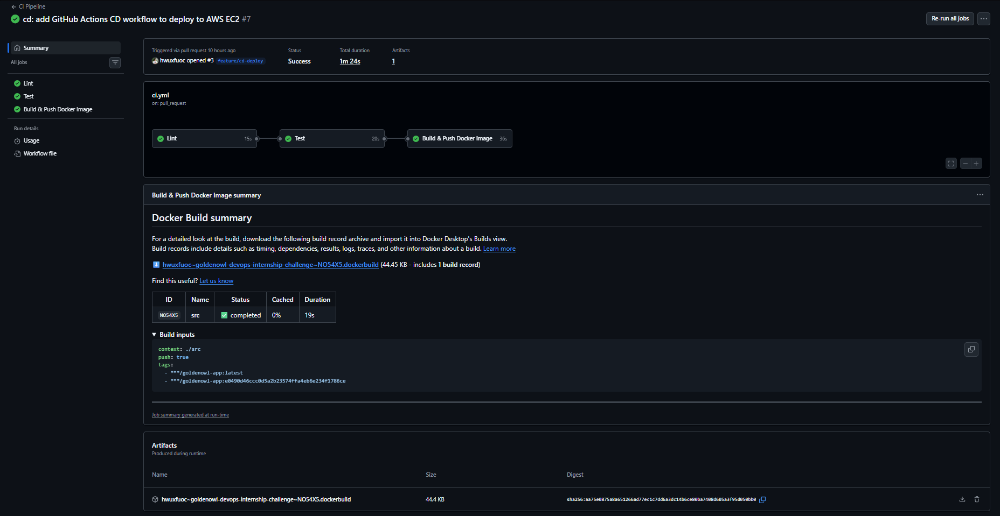
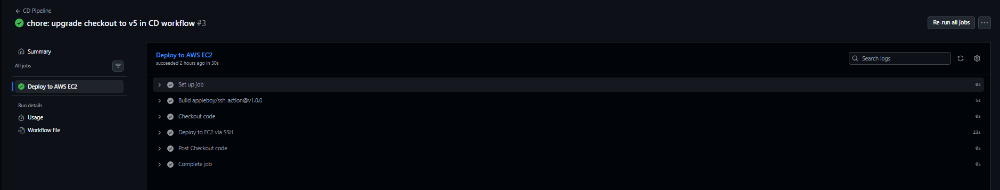
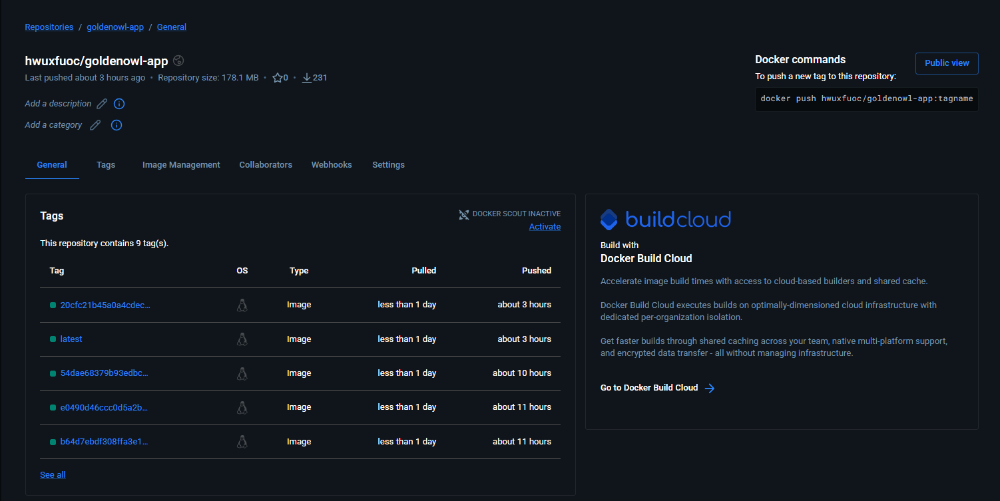
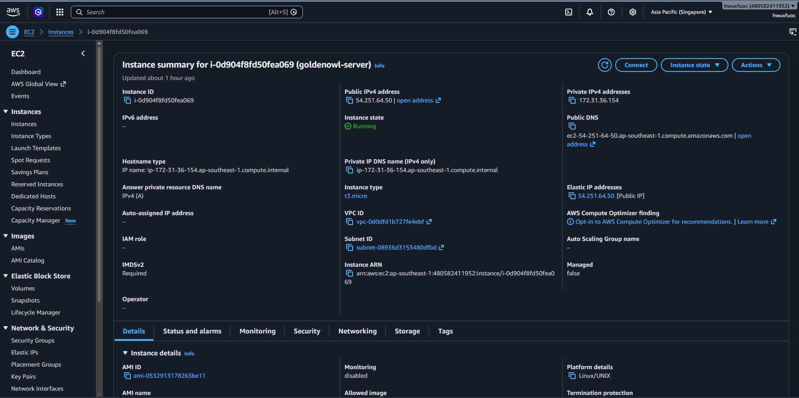
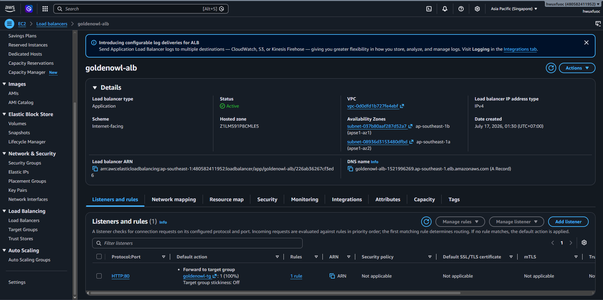
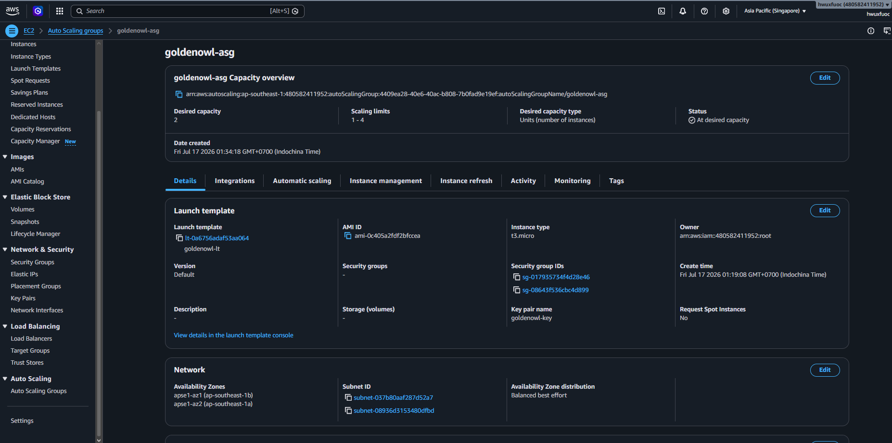
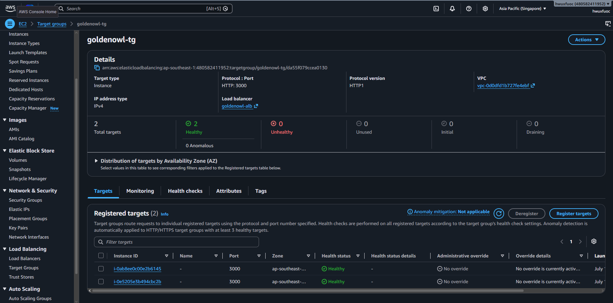

# Golden Owl DevOps Internship - Technical Test
At Golden Owl, we believe in treating infrastructure as code and automating resource provisioning to the fullest extent possible. 

In this technical test, we challenge you to create a robust CI build pipeline using GitHub Actions. You have the freedom to complete this test in your local environment.

## Your Mission 🌟
Your mission, should you choose to accept it, is to craft a CI job that:
1. Forks this repository to your personal GitHub account.
2. Dockerizes a Node.js application.
3. Establishes an automated CI/CD build process using GitHub Actions workflow and a container registry service such as DockerHub or Amazon Elastic Container Registry (ECR) or similar services.
4. Initiates CI tests automatically when changes are pushed to the feature branch on GitHub.
5. Utilizes GitHub Actions for Continuous Deployment (CD) to deploy the application to major cloud providers like AWS EC2, AWS ECS or Google Cloud (please submit the deployment link).
## Nice to have 🎨
We would be genuinely delighted if you could complement your submission with a `visual flow diagram`, illustrating the sequence of tasks you performed, including the implementation of a `load balancer` and `auto scaling` for the deployed application. This additional touch would greatly enhance our understanding and appreciation of your work.

Reference tools for creating visual flow diagrams:
- https://www.drawio.com/
- https://excalidraw.com/
- https://www.eraser.io/
  
Including a visual representation of your workflow will provide valuable insights into your approach and make your submission stand out. Thank you for considering this enhancement! 
## The Bigger Picture 🌏
This test is designed to evaluate your ability to implement modern automated infrastructure practices while demonstrating a basic understanding of Docker containers. In your solution, we encourage you to prioritize readability, maintainability, and the principles of DevOps.

 ## Submission Guidelines 📬
Your solution should be showcased in a public GitHub repository. We encourage you to commit early and often. We prefer to see a history of iterative progress rather than a single massive push. When you've completed the assignment, kindly share the URL of your repository with us.

 ## Running the Node.js Application Locally  🏃‍♂️
 This is a Node.js application, and running it locally is straightforward:
- Navigate to the `src` directory by executing `cd src`.
- Install the project's dependencies listed in the package.json file by running `npm i`.
- Execute `npm test` to run the application's tests.
- Start the HTTP server with `npm start`.

You can test it using the following command:
  
```shell
curl localhost:3000
```
You should receive the following response:
```json
{"message":"Welcome warriors to Golden Owl!"}
```

Are you ready to embark on this DevOps journey with us? 🚀 Best of luck with your assignment! 🌟

# My Deployment 🚀

This project implements a complete DevOps pipeline following modern best practices: code is automatically validated, containerized, and deployed to the cloud on every push with zero manual intervention.

## Live URL
- **EC2**: [`goldenowl-server`](http://54.251.64.50:3000)
- **ALB**: [`goldenowl-alb`](http://goldenowl-alb-1521996269.ap-southeast-1.elb.amazonaws.com)
- **DockerHub**: [`hwuxfuoc/goldenowl-app`](https://hub.docker.com/r/hwuxfuoc/goldenowl-app)

## What I Built

### 1. Dockerized the Node.js Application
The Express app is packaged using a **multi-stage Docker build** with `node:18-alpine` as the base image. The multi-stage approach separates the build environment from the runtime image, resulting in a smaller, more secure final image.

### 2. CI Pipeline (GitHub Actions)
Triggers automatically on every push to `feature/**` branches and on pull requests to `master`. Each run goes through three sequential jobs:

- **Lint**: ESLint validates code style and catches syntax issues early
- **Test**: Jest runs all unit tests to ensure business logic is correct
- **Build & Push**: Docker image is built and pushed to DockerHub with both a `latest` tag and a commit SHA tag for traceability

### 3. CD Pipeline (GitHub Actions)
Triggers automatically when a pull request is merged into `master`. The pipeline:

1. SSHes into the AWS EC2 instance using a stored private key
2. Pulls the latest Docker image from DockerHub
3. Stops and removes the existing container
4. Starts a new container with `--restart unless-stopped` for auto-recovery on reboot

### 4. Infrastructure
- **AWS EC2** (`t3.micro`, Ubuntu 22.04): Hosts the containerized Node.js application on port 3000
- **AWS ALB** (Application Load Balancer): Accepts public HTTP traffic on port 80 and forwards it to the EC2 target group
- **AWS Auto Scaling Group**: Maintains a desired capacity of 2 instances, scales up to 4 when CPU exceeds 70%, and scales back down when load drops

## Architecture Diagram
End-to-end overview of the CI/CD pipeline and AWS infrastructure.



## CI/CD in Action
GitHub Actions workflows running automatically on push and merge events.




## Docker Registry
Image is automatically built and pushed to DockerHub on every CI run.



## AWS Infrastructure
### EC2 Instance
Ubuntu 22.04 on `t3.micro`, running the app inside a Docker container on port 3000.



### Application Load Balancer
Internet-facing ALB listening on port 80, forwarding traffic to EC2 instances on port 3000.



### Auto Scaling Group
Scales EC2 instances between 1–4 based on CPU usage. Desired capacity: 2.



### Target Group (Healthy Instances)
Health check on `GET /` — instances must return 200 to receive traffic.


